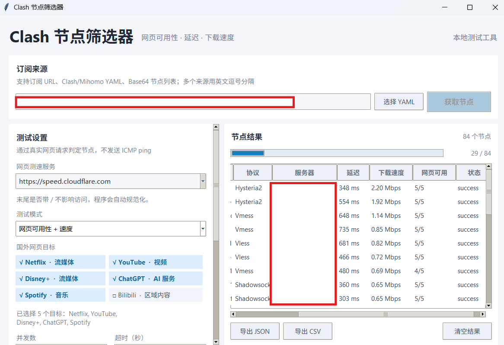

# Clash 节点筛选器

Windows 桌面 GUI，用真实 HTTP/HTTPS 网页访问批量验证 Clash/Mihomo 订阅节点，不使用 ping。项目参考 [zhsama/clash-speedtest](https://github.com/zhsama/clash-speedtest)，界面采用单一主窗口和 FlClash 风格的浅色信息布局。

## 功能

- 支持订阅链接、Clash/Mihomo YAML、Base64 节点列表，可一次输入多个来源。
- 使用本地 Mihomo 核心解析节点并建立代理连接。
- 访问 Cloudflare 测速接口及预设网页目标，检测延迟、丢包、下载/上传速度和平台可用性。
- 国外网页目标支持点击多选，使用 `√` / `□` 显示状态。
- 可设置并发数、单阶段超时、最大延迟和样本大小。
- 实时显示节点结果，结果表支持横向滚动，可导出 JSON/CSV。
- 核心仅监听 `127.0.0.1:18080`，以隐藏窗口启动，不弹出终端。
- 支持 Windows 高 DPI 显示。

## 界面预览



## 下载

请在 GitHub Releases 页面下载最新的 `ClashNodeFilter.exe`。下载后直接运行即可，无需安装 Go 或 Python。

## 从源码运行

环境要求：Windows、Python 3.8+、Go 1.22+。

```powershell
git clone <仓库地址>
cd clash-node-filter
python -m pip install -r requirements.txt
.\build.ps1
python .\desktop_app.py
```

生成可分发目录：

```powershell
.\build_gui.ps1
```

生成的单文件程序位于 `dist\Clash节点筛选器.exe`。

## 测试说明

“超时（秒）”限制单个网络阶段；一个节点可能依次执行延迟、网页目标和测速，因此整批任务耗时可能更长。程序同时设置整批保护时限，支持“停止当前测试”。网页访问失败可能由节点本身、目标站点限制、DNS 或本地网络造成；单个平台失败不等于节点完全不可用。

请只测试你有权使用的订阅。测速会产生实际流量，建议先使用较小的样本大小。

## 目录

- `desktop_app.py`：桌面 GUI 和本地 API 客户端。
- `backend/`：Mihomo 核心服务、节点解析、网页测试和解锁检测。
- `build.ps1`：编译本地测试核心。
- `build_gui.ps1`：使用 PyInstaller 打包 Windows GUI。
- `backend/desktop-config.yaml`：桌面模式配置。

## 致谢

感谢 [zhsama/clash-speedtest](https://github.com/zhsama/clash-speedtest) 提供参考实现，感谢 [linux.do 社区](https://linux.do/) 的交流与分享。
